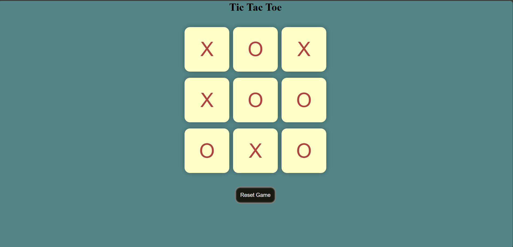

# 🎮 Tic-Tac-Toe Game

A classic **Tic-Tac-Toe** game built with HTML, CSS, and JavaScript. Play against a friend and see who wins the battle of Xs and Os!

🔗 **Live Demo**: [tic-tac-toe122.netlify.app](https://tic-tac-toe122.netlify.app/)

---

## 📸 Preview

---

## 🚀 Features

- ✅ Simple, clean, and responsive UI
- ✅ Two-player mode
- ✅ Game win/draw logic
- ✅ Play again / Reset functionality

---

## 🛠️ Built With

- **HTML5**
- **CSS3**
- **JavaScript (Vanilla)**

---

## 📁 Project Structure
┗ 📂 image
┣ 📄 pic.png
┣ 📄 index.html
┣ 📄 style.css
┣ 📄 script.js

---

## 🧠 How to Play

1. Player 1 uses **X**, Player 2 uses **O**
2. Take turns clicking empty boxes
3. First to align 3 marks (horizontally, vertically, or diagonally) wins
4. Click **Reset** to play again

---

## 🧑‍💻 Author

Made with ❤️ by [Ritik Kumar](https://github.com/ritik-kumar123)

---

## 🌐 License

This project is open-source and free to use under the [MIT License](LICENSE).

